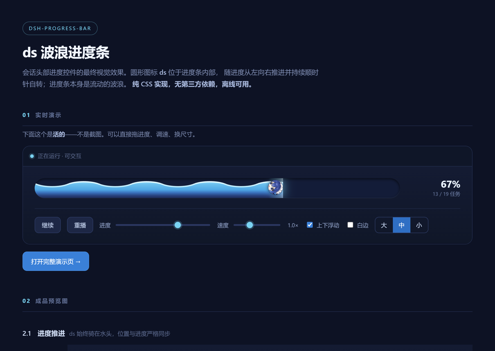
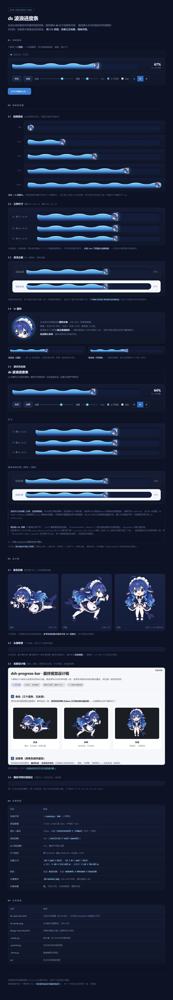

# dsh-progress-bar

DeepSeek Harness Web 客户端的**会话头部进度控件**：一条横放的 **ds 波浪进度条** —— 胶囊形水道 + 持续滚动的正弦波 + 泡在水里往前游的 ds 头像，点开是本会话的任务清单与后台作业列表。



> 一句话原则：**只显示能证明的数字。**
> 百分比只有一个来源（会话的 `todos` 投影）。后台作业的 `progress` 是**字符串**（一行进度文案），它永远不会被换算成百分比，也不会和任务清单加总成"综合进度"。

---

## 本次更新：升级为 ds 波浪进度条（v0.2.0）

会话头部那个 22×4px 的小进度条被整体替换为 ds 波浪进度条。**纯 CSS 实现，没有引入任何动画库**：波纹用 SVG 路径当 `mask` 把渐变切成波浪形，动画只改 `transform` 走 GPU 合成层；断网可用（头像以 data URI 内联，产物仍是单个 `client.js`）。

完整设计汇总页（实时演示 + 五进度态 + 三档尺寸 + 深浅主题 + 无白边对照）：



### 视觉参数（逐条取自 `reference/ds-wave-bar.html`，原型是权威）

| 部位 | 取值 |
|---|---|
| 档位 | 槽高 / ds / 边距 = **34 / 24 / 7**（头部档，写在 `.track` 默认值里，改那三行即换档；另有 `sizeL` 52/38/11、`sizeM` 44/32/9、`sizeS` 同头部档） |
| 槽 | 底 `#131c38`，`inset 0 2px 6px rgba(0,0,0,.65)` 压出深度 + `inset 0 -1px 0 rgba(120,170,255,.10)` 给槽口厚度，`isolation:isolate` |
| 水体 | `linear-gradient(180deg, #4fa6e4 0%, #3a72bd 34%, #28407a 72%, #1e2c58 100%)`，顶边 = `surface + 11px` |
| 波浪 | SVG 路径当 mask（`mask-size: 140px 22px`），中线在槽高 34% 处、振幅 **±5.5px**；元素宽 `calc(100% + 140px)`，每 3.6s 平移恰好 −140px（一个波长，无缝） |
| 浪花 | 同一套 mask、同一个 animation，整体抬高 3px 并画在水面**之前**（z 序更低）→ 任何相位都严格平行于水面 |
| 水头 | 光晕 `6px 0 20px rgba(122,211,242,.30)` + 贴 `.fill` 右缘的 `.surf` 32px 横向渐变 |
| ds 头像 | `reference/ds-avatar-160.png` 以 data URI 内联；**无白圈**，靠 1px `rgba(20,32,64,.45)` 压边 + `0 0 14px rgba(122,211,242,.40)` 外发光分离 |
| 动效 | 波浪 3.6s、自转 2.9s、上下浮动 3.6s；时长统一写 `calc(T / var(--speed))`，一个变量同时调速 |
| 层序 | 水体 → 浪花 → 前浪 → 水头高光；ds 独立挂在轨道上（`z-index:2` 压在水体之上），两层 transform 拆开：外层只平移、内层只自转 |

### 为什么头部档是 34px 而不是原型 mock 的 38px

原型的会话头部 mock 用 38/26/8，但它是在不知道真实布局约束的情况下画的。真实约束写在 DSH 自己的会话头样式里：`headerActions` 与 `titleRow` 同处 grid 第 2 列，**这一行的高度预算是 `titleRow` 的 `min-height:30px`**，控件超过它就会把整个头部撑高——38px 会撑 +7px，34px 只撑 +3px。所以头部档定为 34/24/7（水体厚度仍有 11.4px），并按"一处可改"的方式写在 `.track` 默认值里。

### 验证状态（诚实标注）

**实测过**（Playwright 驱动本机 Edge 渲染真实组件 + 真实 CSS 管线）：五个进度值下 **水头与 ds 圆心误差 0.000px**；0% 左缘 / 100% 右缘精确等于 `pad`（100% 那次把自转定格在 rotation=0 才量）；浪花亮边 **2.5–3.0 CSS px** 且在 9 个相位（含 18000/30000ms）偏移恒为 2.984px，两个波浪动画 `startTime` 差 0ms、keyframes 完全相同（**不可能错相**）；`.wave` 盒底与 `.water` 顶边 DOM 上**完全重合**；三档尺寸下水面高度 = 槽高 34%；`prefers-reduced-motion` 下动画数为 0 且静态仍保留完整波形与 3px 浪花边；深浅主题下水体饱和度**完全相同**（固定色、不被主题洗灰）；展开面板 top = root.bottom + 5px、窄窗 400px 时仍夹在视口内（left 20 / right 12）。

**没有实测**：真实 DSH 会话头部的总高（需要已登录的 GUI）；浅色主题下的实际观感；面板内部的 `StateDot`/图标（验证夹具里 `@deepseek-ai/dsh-client-ui-primitives` 是桩件）；`reference/showcase.html` 里两张过程图（`_avatar_variants.png`、`_dsprobe.png`）**源文件未随素材交付**，渲染预览图时把它们设为不可见，其余原样。

---

## 它显示什么 / 不显示什么

| 场景 | 头部显示 | 说明 |
|---|---|---|
| 会话有 `todos` 清单 | `3/7 · 43%` + 迷你进度条 | 百分比 = `completed / total`，**唯一**的真实百分比 |
| 无清单，但有运行中的后台作业 | `运行中 · 12秒` | 12 秒是**那个作业自己的** `startedAt → now` |
| 无清单、无作业，但会话在运行 | `运行中` | 不定态流动条；**不显示任何计时器** |
| 以上三者皆无 | **不渲染任何节点** | 空转的计时器是噪音，也会误导人以为有任务在跑 |

---

## 图片资源

`docs/` 下两张图都是把 `reference/showcase.html` 用本机 Edge **渲染出来的设计稿成图**（不是实机截图）：

| 文件 | 内容 |
|---|---|
| `docs/preview.png` | 汇总页首屏：实时演示条（定格在 67%）+ 控制栏 |
| `docs/showcase.png` | 汇总页整页：五进度态 / 三档尺寸 / 深浅主题 / 无白边对照 / 泳姿 |

渲染脚本不随本仓库提供（它属于我的验证工程）。渲染时把两张过程图 `_avatar_variants.png` 与 `_dsprobe.png` 设为不可见 —— 这两个文件**没有随 `reference/` 一起交付**，不处理就会渲染成破图；其余图片原样。

**实机截图待补**：真机头部与展开面板需要已登录的会话才能截，我这边拿不到登录态，所以留空：

- `docs/screenshot.png` —— 收起态：头部进度条（待补）
- `docs/screenshot-panel.png` —— 展开态：任务清单 + 后台作业 + 进度条（待补）

---

## 安装

本插件是标准的 dsh 双面包（host 半为空 `apply`，浏览器半提供全部功能），通过 `dsh.bundle.patch` 自带挂载层，安装后无需手改 profile。

```bash
# 官方 CLI（会读取本包的 cordis.patch.yml，自动追加到 profile 的 bundle 栈）
dsh plugin --profile <profile-name> add dsh-progress-bar@<version>
```

手动安装（把包放进 profile 的依赖后）：

```bash
cd ~/.dsh/profiles/<profile-name>
pnpm add dsh-progress-bar@<version>      # 或在 package.json 里加依赖后 pnpm install
# 然后在 profile 的 cordis.patch.yml 里加：
# - insert:
#     - id: progress-bar
#       name: 'dsh-progress-bar'
```

安装后**硬刷新浏览器**（Ctrl/Cmd+Shift+R）。client 半改动无需重启 dsh。

卸载：`dsh plugin --profile <profile-name> remove dsh-progress-bar`，并确认 profile 里没有残留的手动挂载行（同包双挂载会得到两份 Node 半）。

---

## 数据源与语义

| 数据 | 来源 | 类型（权威声明） |
|---|---|---|
| 任务清单 | `useProjection('todos')` 会话投影 | `TodoItem[] \| null`，`TodoItem = { content: string; status: 'pending' \| 'in_progress' \| 'completed' }` |
| 后台作业 | `ctx.jobs.state`（`dsh-api-job-controller` 安装的按引用计数服务），`watchRows(sessionId)` 跟随名册 | `JobView`：`id / kind / label / status / progress? / detail? / startedAt / finishedAt? / output.total` |
| 是否在运行 / 是否在等你确认 | `useSession(s => s.running)`、`useSessionStatus(snapshot => snapshot.get(sessionId)?.pendingInteraction)` | `SessionSnapshot.running`、`SessionStatus.pendingInteraction` |

注册位置：插槽 `conversation.session.header.actions`（`kind: 'list'`、`scope: 'session'`），条目 `id: 'progress'`、`order: 30`（官方 `job-list` 是 20，本插件排在其后）。

### 降级行为

- **首次 `todo_write` 之前**，`todos` 投影为 `null`；宿主未挂 `ctx.sessionProjections` 时该键永远缺失。两种情况下都**不显示百分比**，进度条退化为不定态，并显示说明文案。
- 宿主重启会丢失作业环与名册；重连后首帧即为完整事实。
- `output.total` 是**保留字节数**，只用于显示"保留输出 1.2 MB"，不代表工作量。

---

## 已知限制

1. **不显示"本轮已运行多久"。** `SessionSnapshot` 的权威字段里**没有**回合起点时间戳（只有 `sessionId / pendingSubmissions / running / subagent / removed / openState / openError / hasMore / loadingOlder / promptError / blank / lastAgentError / promptAttempted / awaitingFirstTurn`），而 `ui-conversation` 的 `openTurn()` 返回的是**回合编号**而非时间。因此本插件只显示后台作业自己的耗时；"运行中但无作业"时只显示"运行中"。这是有意为之：宁可少一个数字，也不要一个刷新后就错的数字。
2. **只读。** 不提供 kill / 停止按钮，也不展开作业输出终端。
3. **CSS Modules 只支持相对路径导入**（`./X.module.css`）。从 `node_modules` 引入的 `.module.css` 不在自写 CSS 插件的解析范围内。
4. `pendingInteraction` 只做存在性判断，不展示具体交互内容。
5. 进度依赖模型遵守 `todo_write` 的约定：模型不更新清单时百分比会滞后——这是数据本身的语义，不是估算误差。

---

## 开发与构建

前置：Node ≥ 20、pnpm ≥ 10（本机验证于 Node 24.21.0 / pnpm 11.7.0）。

```bash
pnpm install --node-linker=hoisted   # 见下方说明
pnpm typecheck                       # tsc --noEmit，期望无输出、exit 0
pnpm build                           # → lib/index.js + lib/client.js + lib/types/**
pnpm watch                           # tsdown --watch
```

> **为什么要 `--node-linker=hoisted`**：pnpm 默认的 isolated 布局在 Windows + 长路径下会 `[ERR_PNPM_SYMLINK_FAILED] Maximum call stack size exceeded`。本机真实 profile 用的也是 hoisted 布局。

### 构建产物（本仓库 `lib/` 不入 git，仅构建时生成）

```
lib/index.js                     Node 半（ESM）
lib/client.js                    浏览器半（CJS + __ModuleLoader__ 包装）
lib/types/index.d.ts              Node 半类型
lib/types/client/index.d.ts       浏览器半类型
```

### 产物自检

```bash
node -e "const s=require('node:fs').readFileSync('lib/client.js','utf8');for(const [k,p] of Object.entries({loader:/^window\.__ModuleLoader__\.load\(\{/,mod:/var module = \{ exports: \{\} \};/,exp:/var exports = module\.exports;/,react:/require\(\"react\"\)/,prims:/require\(\"@deepseek-ai\/dsh-client-ui-primitives\"\)/,apply:/exports\.apply/,inject:/exports\.inject/,css:/data-plugin-css/,tail:/return module\.exports;\s*\}\s*\}\);/}))console.log(k,p.test(s)?'PASS':'FAIL')"
```

预期 9 行全 `PASS`。

### 构建配置为什么是自包含的

官方 monorepo 的 `packages/client/tsdown.client.ts`（`clientBundle()` 预设）不随 npm 发布物分发，独立仓库拿不到。本仓库用 `tsdown.config.ts` + `tsdown.client-css.ts` 等价实现其四项职责：

1. **JSX/TSX**：`jsx: react-jsx`（automatic runtime）。
2. **CSS Modules**：自写 rolldown 插件用 `lightningcss` 编译 `.module.css`，产出**扁平类名映射**并把编译后的 CSS 作为字符串内联、由模块自己注入 `<style data-plugin-css="<pkg>/<相对路径>">`。虚拟模块 id 形如 `\0dsh-css:<绝对路径>.module.css.mjs`——末尾的 `.mjs` 是必需的，用来躲开 CSS 插件对 `.css` 后缀的 id 过滤（照抄官方预设的做法）。
3. **模块包装**：`format: 'cjs'` + `banner`/`footer` 生成宿主要的 `window.__ModuleLoader__.load({ id, factory: (require) => { var module = { exports: {} }; var exports = module.exports; … return module.exports; } })` 闭包。
4. **externals**：`deps.neverBundle`（`external` 在 tsdown 0.22 已废弃）列出 `react` / `react-dom` / `react/jsx-runtime` / `@deepseek-ai/*`，让它们保持 `require(...)`；其余依赖内联。

---

## 验证基线

- 开发与构建验证于 **dsh 0.2.0-rc.2**（`~/.dsh/dsh-runtimes/*/runtime.json` 的 `desktopVersion`，且运行时里全部 `@deepseek-ai/dsh-client-*` 均为 `0.2.0-rc.2`）。
- 类型与运行时 API 均取自该版本**已发布的 `.d.ts` 与已编译产物**，未使用推测字段。
- npm 上这些包的 `next` 通道即 `0.2.0-rc.2`；`alpha` 通道为 `0.2.1-alpha.1`（更新，但未在本机运行时验证）。

---

## 目录结构

```
src/index.ts                    Node 半（空 apply，占一个 Loader 行）
src/client/index.ts             inject + apply：注册词典、注册 header action
src/client/ProgressBadge.tsx     触发器 + 展开面板（唯一组件）
src/client/progress.ts           纯函数：计数 / 百分比 / 时长拆分 / 字节（无 React）
src/client/locales.ts            NS='progress'，zh 为键集合事实源，en 键完全对齐
src/client/ProgressBadge.module.css
src/client/css-modules.d.ts
tsdown.config.ts                两个入口：Node 半 + 客户端半
tsdown.client-css.ts            CSS Modules 插件
tsconfig.json / tsconfig.build.json
cordis.patch.yml                dsh.bundle.patch 挂载层
```

---

## 许可

本仓库暂未附带 LICENSE 文件。在补充之前，请视为"保留所有权利"。
