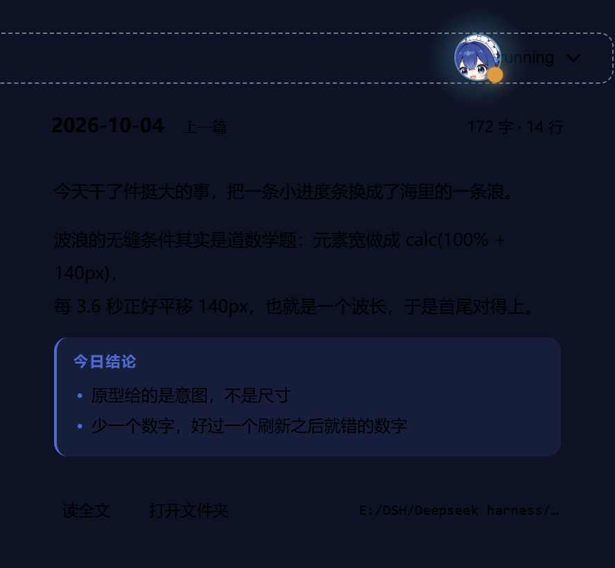
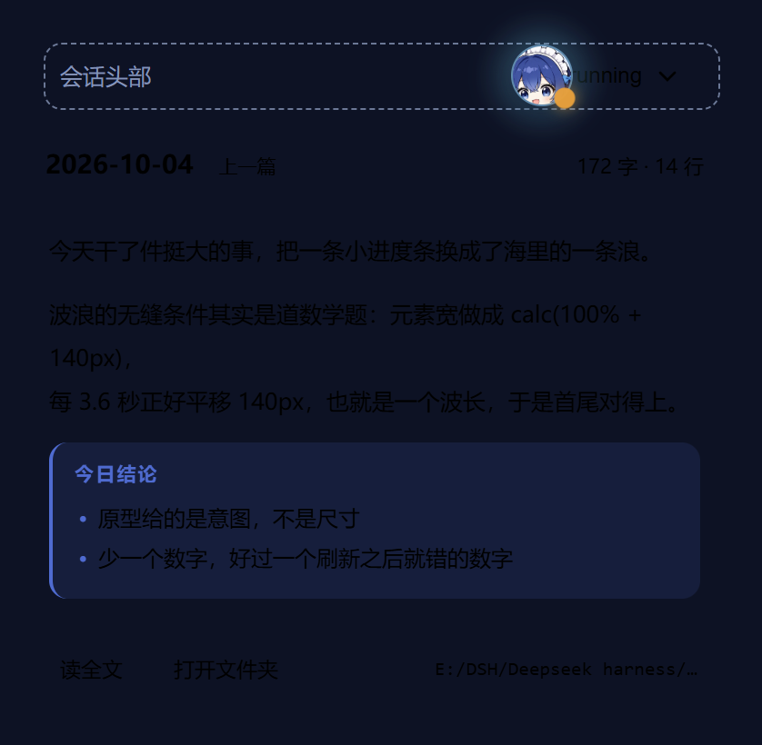

# dsh-progress-bar

DeepSeek Harness Web 客户端的**整帧常驻进度控件**：一条横放的 **ds 波浪进度条** —— 胶囊形水道 + 持续滚动的正弦波 + 泡在水里往前游的 ds 头像，点开是本会话的任务清单与后台作业列表。

它常驻在整帧浮层上（`shell.overlay`），不随会话或面板消失：没有任务时是头部右上角一颗 **32px 的球**，有任务了才展开成波浪条。**空白会话（新建会话的 Hero 态）也照样常驻** —— 入口要一直在，只是那时没有数字可显示。


> 一句话原则：**只显示能证明的数字。**
> 百分比只有一个来源（会话的 `todos` 投影）。后台作业的 `progress` 是**字符串**（一行进度文案），它永远不会被换算成百分比，也不会和任务清单加总成"综合进度"。

---

## 本次更新：升级为 ds 波浪进度条（v0.2.0）

会话头部那个 22×4px 的小进度条被整体替换为 ds 波浪进度条。**纯 CSS 实现，没有引入任何动画库**：波纹用 SVG 路径当 `mask` 把渐变切成波浪形，动画只改 `transform` 走 GPU 合成层；断网可用（头像以 data URI 内联，产物仍是单个 `client.js`）。

完整设计汇总页（实时演示 + 五进度态 + 三档尺寸 + 深浅主题 + 无白边对照）：


### 视觉参数（逐条取自 `reference/ds-wave-bar.html`，原型是权威）

| 部位 | 取值 |
|---|---|
| 档位 | 槽高 / ds / 边距 = **34 / 24 / 7**（头部档，写在 `.track` 默认值里，改那三行即换档；另有 `sizeL` 52/38/11、`sizeM` 44/32/9、`sizeS` 同头部档） |
| 槽 | 底 `#131c38`，`inset 0 2px 6px rgba(0,0,0,.65)` 压出深度 + `inset 0 -1px 0 rgba(120,170,255,.10)` 给槽口厚度，`isolation:isolate` |
| 水体 | `linear-gradient(180deg, #4fa6e4 0%, #3a72bd 34%, #28407a 72%, #1e2c58 100%)`，顶边 = `surface + 11px` |
| 波浪 | SVG 路径当 mask（`mask-size: 140px 22px`），中线在槽高 34% 处、振幅 **±5.5px**；元素宽 `calc(100% + 140px)`，每 3.6s 平移恰好 −140px（一个波长，无缝） |
| 浪花 | 同一套 mask、同一个 animation，整体抬高 3px 并画在水面**之前**（z 序更低）→ 任何相位都严格平行于水面 |
| 水头 | 光晕 `6px 0 20px rgba(122,211,242,.30)` + 贴 `.fill` 右缘的 `.surf` 32px 横向渐变 |
| ds 头像 | `reference/ds-avatar-160.png` 以 data URI 内联；**无白圈**，靠 1px `rgba(20,32,64,.45)` 压边 + `0 0 14px rgba(122,211,242,.40)` 外发光分离 |
| 动效 | 波浪 3.6s、自转 2.9s、上下浮动 3.6s；时长统一写 `calc(T / var(--speed))`，一个变量同时调速 |
| 层序 | 水体 → 浪花 → 前浪 → 水头高光；ds 独立挂在轨道上（`z-index:2` 压在水体之上），两层 transform 拆开：外层只平移、内层只自转 |

### 为什么头部档是 34px 而不是原型 mock 的 38px

原型的会话头部 mock 用 38/26/8，但它是在不知道真实布局约束的情况下画的。真实约束写在 DSH 自己的会话头样式里：`headerActions` 与 `titleRow` 同处 grid 第 2 列，**这一行的高度预算是 `titleRow` 的 `min-height:30px`**，控件超过它就会把整个头部撑高——38px 会撑 +7px，34px 只撑 +3px。所以头部档定为 34/24/7（水体厚度仍有 11.4px），并按"一处可改"的方式写在 `.track` 默认值里。

### 验证状态（诚实标注）

**实测过**（Playwright 驱动本机 Edge 渲染真实组件 + 真实 CSS 管线）：五个进度值下 **水头与 ds 圆心误差 0.000px**；0% 左缘 / 100% 右缘精确等于 `pad`（100% 那次把自转定格在 rotation=0 才量）；浪花亮边 **2.5–3.0 CSS px** 且在 9 个相位（含 18000/30000ms）偏移恒为 2.984px，两个波浪动画 `startTime` 差 0ms、keyframes 完全相同（**不可能错相**）；`.wave` 盒底与 `.water` 顶边 DOM 上**完全重合**；三档尺寸下水面高度 = 槽高 34%；`prefers-reduced-motion` 下动画数为 0 且静态仍保留完整波形与 3px 浪花边；深浅主题下水体饱和度**完全相同**（固定色、不被主题洗灰）；展开面板 top = root.bottom + 5px、窄窗 400px 时仍夹在视口内（left 20 / right 12）。

**没有实测**：浅色主题下的实际观感；面板内部的 `StateDot`/图标（验证夹具里 `@deepseek-ai/dsh-client-ui-primitives` 是桩件）。实机几何（球距帧右缘 183px、球心 y=25、idle 读数不占布局）已在无头 Chrome 直连宿主 Web UI 下核对，见「图片资源」。

---

## 本次更新：常驻球 · 菜单 · 角标 · 日记联动（v0.3.0）

进度控件从"一条进度条"变成一个**常驻的球**：会话头部始终有一个入口，点开是本会话的任务清单、后台作业与日记。

### 常驻球与三态

没有任务时它是 **32px 的球**，常驻在头部右上角（v0.3.2 起挂在整帧浮层上，见下节），不再整块消失；一旦有任务就展开成 **340×44 的水道**。三态由会话自身的信号驱动：`idle`（空闲）/ `working`（有任务或作业在跑）/ `waiting`（在等你确认一次操作）。

| idle：32px 的球 | working：340×44 的水道 |
|---|---|
|  |  |

### 菜单

点球打开菜单，三项：**写今天的日记**（今天的已写过就变成"重写今天的日记"）、**读上一篇日记**、**任务详情**。菜单和卡片、面板三者互斥，点浮层外面任意处一起收起。

### 角标

球右下角的小圆点表示**今天的日记写没写**：已写为实心、未写为空心。写作中或等待确认时自动隐藏 —— 那两件事比"今天写没写"更该被看到，角落的位置让给它们。

### 日记联动

**写日记时水体转墨蓝**，作为"正在写"的独立信号，不靠文字。读上一篇日记时，卡片按日记的**四段结构**（日期行 / 正文 / `## 今日结论` / `—— Echo` 署名）解析，把「今日结论」渲染成一块高亮带，其余段落按序留在原位；没有结论小节的旧日记正常降级，不留空块。

| 日记卡片：结论高亮带 + 右对齐署名 | 窄窗夹取 |
|---|---|
|  |  |

> 上面四张 `docs/` 图是**夹具成图**（仓库外的验证工程用真实组件 + 真实 CSS 管线渲染），不是实机截图。真机截图见下方「图片资源」。

---

## 本次更新：常驻球迁入整帧浮层（v0.3.2）

常驻球之前挂在会话头部的动作槽里，空白会话下它**根本不存在**。v0.3.2 把它迁到了整帧浮层，现在它在任何状态下都在。

### 为什么迁

原槽位 `conversation.session.header.actions` 属于 header 的 titleCluster，而宿主把整个 titleCluster 用 `!hideChrome` 门控了 —— **空白会话下这些元素根本不进 DOM**，不是隐藏，是压根没渲染。所以"新会话的 Hero 态看不到球"不是样式问题，是挂载点选错了。

`shell.overlay` 是 DSH 官方的整帧浮层席位（`kind: 'list'`、`scope: 'root'`），恒渲染，不随会话/面板消失。官方文档对它的描述就是给这类东西用的："Frame-wide floating layer, above every column and outside their scroll containers. Deliberately generic and unowned by any feature: a badge, a toast stack or a status pill all belong here."

### 为什么不用「注入脚本自建 DOM」

那条路官方文档明确禁止：**"Do not replace the app root or append a second application to document.body."** 除了违规，它在这里也不可行 —— 本插件的宿主半只 inject 了 `webServer` + `sessionController`，碰不到 todo 与 jobs，把界面做成纯 DOM 浮层会把主功能整个弄丢。走官方槽位，组件仍是 React 组件，`hooks` 与 `watchRows` 照常注入。

### 身份来源改为 `uiWorkspace.selection`

root 作用域没有 `sessionId` prop，所以身份改从工作区选择器的 store 读（`ctx.uiWorkspace.selection`，persist 名就是 `dsh.sessions.current`）。因此**空白会话也有 sessionId** —— 空白会话是一个真实存在的 session（`blank: true`），只是它的 jobs 表是空的，于是自然落到 `idle`，显示裸球。真正为 `undefined` 的只有"一个会话都没有"的情形。

### 首帧测量与诊断

整帧浮层**早于会话 header** 渲染，所以首帧可能量不到 header 里的参照带。现在测量会在找不到参照时**按帧重试（上限 2 秒）**，而不是就此沿用兜底常量；`sessionId` 变化会重新触发测量，`resize` 会重置重试窗口。反查校验也不再拿 `display: contents` 的槽位包装（rect 恒为零，只会永久误报）当参照，改为与正查同一个 band 比较。

### idle 态按设计稿隐藏读数

读数在 idle 下 `opacity: 0` 且 `position: absolute`，**不参与布局**。否则 116px 的根节点会把 32px 的球挤到左边，球右缘就落不在席位上。只有 `working` / `waiting` 才淡入读数。

---

## 它显示什么 / 不显示什么

| 场景 | 头部显示 | 说明 |
|---|---|---|
| 会话有 `todos` 清单 | `3/7 · 43%` + 迷你进度条 | 百分比 = `completed / total`，**唯一**的真实百分比 |
| 无清单，但有运行中的后台作业 | `运行中 · 12秒` | 12 秒是**那个作业自己的** `startedAt → now` |
| 无清单、无作业，但会话在运行 | `运行中` | 不定态流动条；**不显示任何计时器** |
| 以上三者皆无 | **32px 的裸球**（不显示读数） | 入口要一直在，但百分比不能编 —— 宁可只有一个球，也不要一个空转的计时器 |

---

## 图片资源

`docs/` 下两张图都是把 `reference/showcase.html` 用本机 Edge **渲染出来的设计稿成图**（不是实机截图）：

| 文件 | 内容 |
|---|---|
| `docs/preview.png` | 汇总页首屏：实时演示条（定格在 67%）+ 控制栏 |
| `docs/showcase.png` | 汇总页整页：五进度态 / 三档尺寸 / 深浅主题 / 无白边对照 / 泳姿 |
| `docs/screenshot-orb.png` | **实机**：非空白会话，球常驻在头部右上角（紧邻工具组） |
| `docs/screenshot-orb-blank.png` | **实机**：空白会话（Hero 态），球同样常驻 |

渲染脚本不随本仓库提供（它属于我的验证工程）。出图时做了两处裁剪：**移除汇总页的「03 设计稿」整节**（3.1 角色形象 / 3.2 头像取景 / 3.3 完整设计稿 / 3.4 可辨识度验证），以及文件清单里两行属于角色创作流水线的条目（`design-final-lite.html`、`_avatar.py`）。`reference/showcase.html` 原件**未改动**，仍保留完整设计过程。

**实机截图**：`screenshot-orb.png` 与 `screenshot-orb-blank.png` 是**无头 Chrome 直连宿主 Web UI 的真实渲染截图**，裁的是右上角局部（442×80），**不是完整头部**。仍待补的是：

- `docs/screenshot.png` —— 完整头部（待补）
- `docs/screenshot-panel.png` —— 展开态：任务清单 + 后台作业 + 进度条（待补）
- `docs/screenshot-diary-card.png`、`docs/screenshot-diary-card-narrow.png` —— v0.3 日记卡片是**夹具成图**（真实组件 + 真实 CSS 管线 + 本机 Edge），不是实机截图

`files` 字段里没有 `docs/`，所以 **npm 包里不带图** —— 图片只给 GitHub 上的 README 看，这是预期的。

---

## 安装

本插件是标准的 dsh 双面包（host 半为空 `apply`，浏览器半提供全部功能），通过 `dsh.bundle.patch` 自带挂载层，安装后无需手改 profile。

```bash
# 官方 CLI（会读取本包的 cordis.patch.yml，自动追加到 profile 的 bundle 栈）
dsh plugin --profile <profile-name> add dsh-progress-bar@<version>
```

手动安装（把包放进 profile 的依赖后）：

```bash
cd ~/.dsh/profiles/<profile-name>
pnpm add dsh-progress-bar@<version>      # 或在 package.json 里加依赖后 pnpm install
# 然后在 profile 的 cordis.patch.yml 里加：
# - insert:
#     - id: progress-bar
#       name: 'dsh-progress-bar'
```

安装后**硬刷新浏览器**（Ctrl/Cmd+Shift+R）。client 半改动无需重启 dsh。

卸载：`dsh plugin --profile <profile-name> remove dsh-progress-bar`，并确认 profile 里没有残留的手动挂载行（同包双挂载会得到两份 Node 半）。

---

## 数据源与语义

| 数据 | 来源 | 类型（权威声明） |
|---|---|---|
| 会话身份 | `useSelection(s => s.sessionId)`，即 `ctx.uiWorkspace.selection` | `SnapshotStore<{ sessionId?: SessionId; subagentAddress?: Address }>`；它 persist 的名字就是 `dsh.sessions.current` |
| 任务清单 | `useSessions(s => s.byId[sessionId])` 那一行的 `projectionValues.todos` | `TodoItem[] \| null`，`TodoItem = { content: string; status: 'pending' \| 'in_progress' \| 'completed' }` |
| 是否在运行 | 同一个 `useSessions` 行的 `running` | `SessionSummary.running` |
| 是否在等你确认 | `useSessionStatus(snapshot => snapshot.get(sessionId)?.pendingInteraction)` | `SessionStatus.pendingInteraction` |
| 后台作业 | `ctx.jobs.state`（`dsh-api-job-controller` 安装的按引用计数服务），`watchRows(sessionId)` 跟随名册 | `JobView`：`id / kind / label / status / progress? / detail? / startedAt / finishedAt? / output.total` |

> **为什么清单和 running 走 `useSessions` 而不是 `useProjection` / `useSession`**：`shell.overlay` 是 `scope: 'root'` 的槽位，宿主只给 root 作用域一份 `GlobalStandardProps`（`useSessions` / `useSessionStatus` / `useSessionRetainInfo`），**拿不到**按会话的 `useProjection` / `useSession` / `sessionId` 那套 kit。所以身份改从 `uiWorkspace.selection` 取，投影与 running 从会话列表行读。
>
> `sessionId` 仍可能为 `undefined`（一个会话都没有时）：此时不查 jobs 表、跳过 `watchRows`、席位保留兜底常量。

注册位置：插槽 **`shell.overlay`**（`kind: 'list'`、`scope: 'root'`），条目 `id: 'progress-orb'`、`order: 50`。

> v0.3.2 之前注册在 `conversation.session.header.actions`（`id: 'progress'`、`order: 30`）。那个槽位被宿主用 `!hideChrome` 门控 —— **空白会话下整个 titleCluster 根本不进 DOM**，球会凭空消失。`shell.overlay` 是官方为此准备的整帧席位，恒渲染，不随会话/面板消失。

### 降级行为

- **首次 `todo_write` 之前**，`todos` 投影为 `null`；宿主未挂 `ctx.sessionProjections` 时该键永远缺失。两种情况下都**不显示百分比**，进度条退化为不定态，并显示说明文案。
- 宿主重启会丢失作业环与名册；重连后首帧即为完整事实。
- `output.total` 是**保留字节数**，只用于显示"保留输出 1.2 MB"，不代表工作量。

---

## 已知限制

1. **不显示"本轮已运行多久"。** `SessionSnapshot` 的权威字段里**没有**回合起点时间戳（只有 `sessionId / pendingSubmissions / running / subagent / removed / openState / openError / hasMore / loadingOlder / promptError / blank / lastAgentError / promptAttempted / awaitingFirstTurn`），而 `ui-conversation` 的 `openTurn()` 返回的是**回合编号**而非时间。因此本插件只显示后台作业自己的耗时；"运行中但无作业"时只显示"运行中"。这是有意为之：宁可少一个数字，也不要一个刷新后就错的数字。
2. **只读。** 不提供 kill / 停止按钮，也不展开作业输出终端。
3. **CSS Modules 只支持相对路径导入**（`./X.module.css`）。从 `node_modules` 引入的 `.module.css` 不在自写 CSS 插件的解析范围内。
4. `pendingInteraction` 只做存在性判断，不展示具体交互内容。
5. 进度依赖模型遵守 `todo_write` 的约定：模型不更新清单时百分比会滞后——这是数据本身的语义，不是估算误差。

---

## 开发与构建

前置：Node ≥ 20、pnpm ≥ 10（本机验证于 Node 24.21.0 / pnpm 11.7.0）。

```bash
pnpm install --node-linker=hoisted   # 见下方说明
pnpm typecheck                       # tsc --noEmit，期望无输出、exit 0
pnpm build                           # → lib/index.js + lib/client.js + lib/types/**
pnpm watch                           # tsdown --watch
```

> **为什么要 `--node-linker=hoisted`**：pnpm 默认的 isolated 布局在 Windows + 长路径下会 `[ERR_PNPM_SYMLINK_FAILED] Maximum call stack size exceeded`。本机真实 profile 用的也是 hoisted 布局。

### 构建产物（本仓库 `lib/` 不入 git，仅构建时生成）

```
lib/index.js                     Node 半（ESM）
lib/client.js                    浏览器半（CJS + __ModuleLoader__ 包装）
lib/types/index.d.ts              Node 半类型
lib/types/client/index.d.ts       浏览器半类型
```

### 产物自检

```bash
node -e "const s=require('node:fs').readFileSync('lib/client.js','utf8');for(const [k,p] of Object.entries({loader:/^window\.__ModuleLoader__\.load\(\{/,mod:/var module = \{ exports: \{\} \};/,exp:/var exports = module\.exports;/,react:/require\(\"react\"\)/,prims:/require\(\"@deepseek-ai\/dsh-client-ui-primitives\"\)/,apply:/exports\.apply/,inject:/exports\.inject/,css:/data-plugin-css/,tail:/return module\.exports;\s*\}\s*\}\);/}))console.log(k,p.test(s)?'PASS':'FAIL')"
```

预期 9 行全 `PASS`。

### 构建配置为什么是自包含的

官方 monorepo 的 `packages/client/tsdown.client.ts`（`clientBundle()` 预设）不随 npm 发布物分发，独立仓库拿不到。本仓库用 `tsdown.config.ts` + `tsdown.client-css.ts` 等价实现其四项职责：

1. **JSX/TSX**：`jsx: react-jsx`（automatic runtime）。
2. **CSS Modules**：自写 rolldown 插件用 `lightningcss` 编译 `.module.css`，产出**扁平类名映射**并把编译后的 CSS 作为字符串内联、由模块自己注入 `<style data-plugin-css="<pkg>/<相对路径>">`。虚拟模块 id 形如 `\0dsh-css:<绝对路径>.module.css.mjs`——末尾的 `.mjs` 是必需的，用来躲开 CSS 插件对 `.css` 后缀的 id 过滤（照抄官方预设的做法）。
3. **模块包装**：`format: 'cjs'` + `banner`/`footer` 生成宿主要的 `window.__ModuleLoader__.load({ id, factory: (require) => { var module = { exports: {} }; var exports = module.exports; … return module.exports; } })` 闭包。
4. **externals**：`deps.neverBundle`（`external` 在 tsdown 0.22 已废弃）列出 `react` / `react-dom` / `react/jsx-runtime` / `@deepseek-ai/*`，让它们保持 `require(...)`；其余依赖内联。

---

## 验证基线

- 开发与构建验证于 **dsh 0.2.0-rc.2**（`~/.dsh/dsh-runtimes/*/runtime.json` 的 `desktopVersion`，且运行时里全部 `@deepseek-ai/dsh-client-*` 均为 `0.2.0-rc.2`）。
- 类型与运行时 API 均取自该版本**已发布的 `.d.ts` 与已编译产物**，未使用推测字段。
- npm 上这些包的 `next` 通道即 `0.2.0-rc.2`；`alpha` 通道为 `0.2.1-alpha.1`（更新，但未在本机运行时验证）。

---

## 目录结构

```
src/index.ts                    Node 半（空 apply，占一个 Loader 行）
src/client/index.ts             inject + apply：注册词典、注册整帧浮层条目（shell.overlay）
src/client/ProgressBadge.tsx     触发器 + 展开面板（唯一组件）
src/client/progress.ts           纯函数：计数 / 百分比 / 时长拆分 / 字节（无 React）
src/client/locales.ts            NS='progress'，zh 为键集合事实源，en 键完全对齐
src/client/ProgressBadge.module.css
src/client/css-modules.d.ts
tsdown.config.ts                两个入口：Node 半 + 客户端半
tsdown.client-css.ts            CSS Modules 插件
tsconfig.json / tsconfig.build.json
cordis.patch.yml                dsh.bundle.patch 挂载层
```

---

## 许可

本仓库暂未附带 LICENSE 文件。在补充之前，请视为"保留所有权利"。
